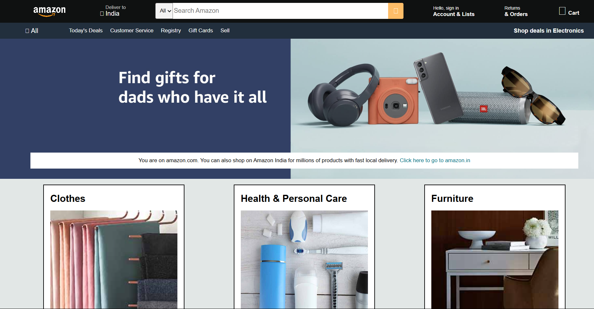

# Amazon Clone

A simple Amazon home page clone built using HTML and CSS. This project replicates the basic layout and design of Amazon's homepage, focusing on responsiveness and styling.

## Features

- Responsive Amazon-style homepage
- Hero section with a promotional banner
- Multiple product category boxes with images
- Navigation bar with Amazon-like styling
- Footer with links similar to Amazon

## Technologies Used

- **HTML5**: Structure of the webpage
- **CSS3**: Styling and layout design

## Installation & Usage

1. Clone this repository:
   ```sh
   git clone https://github.com/hardikagarwal2026/amazon_clone.git
   ```
2. Navigate to the project folder:
   ```sh
   cd amazon_clone-main
   ```
3. Open `index.html` in a web browser.

---

## 📸 UI Preview  

 
  

---

## Future Improvements

- Add JavaScript for interactive features like a working search bar and product slider.
- Implement backend functionality for user authentication and shopping cart.
- Improve responsiveness for better mobile experience.

## Author

- **Hardik Agarwal**
- GitHub: [hardikagarwal2026](https://github.com/hardikagarwal2026)

Feel free to contribute by submitting a pull request or suggesting improvements!
